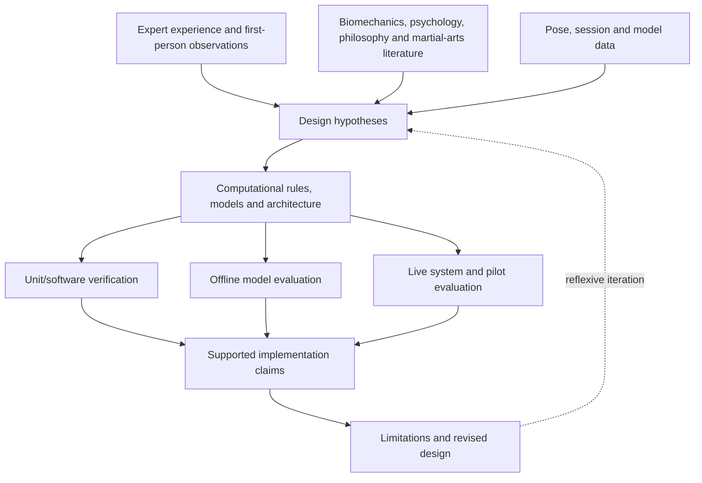

# Combat Cognition architecture and evidence map

## Architectural purpose

Combat Cognition is an explainable hybrid framework that computationally models
**selected functions** associated with martial-arts coaching: perceiving visible
movement, reasoning across time, anticipating short-term motion, maintaining
session and learner context, selecting attention, and delivering feedback.

It is not a complete reproduction of a martial artist, consciousness, human brain,
emotion or combat intelligence. The jab is a representative evaluation technique,
not the definition or universal proof of the framework.

## End-to-end architecture

```mermaid
flowchart LR
    A["Camera or recorded video"] --> B["Perception: pose, hands and face"]
    B --> C["Landmarks, visibility and joint angles"]
    C --> D["L1: current motion state"]
    D --> E["ACP-STGAT: future-pose forecast"]
    C --> F["Phase-classification model"]
    E --> G["L2: action, phase and forecast trust"]
    F --> G
    G --> H["L3: repetition, session, trend and fatigue"]
    H --> I["L4: learner history, weakness and progression"]
    D --> J["Situation awareness"]
    G --> J
    H --> J
    I --> J
    J --> K["Structured coach context packet"]
    K --> L["Reasoning and feedback boundary"]
    L --> M["Validated coaching action and message"]
    M --> N["Live interface, practice record and memory"]
    N -. "later sessions" .-> I
```

The architecture separates **evidence production** from **decision and wording**.
Learned models provide probabilistic temporal evidence. Deterministic gates retain
authority over tracking confidence, forecast trust, ordered phases, feedback
priority and conversation control. This hybrid structure supports explainability
and makes a future OpenAI or local LLM replaceable at the final reasoning boundary.

## Component mapping

| Stage | Cognitive analogy | Implemented computation | Main output | Evidence status |
|---|---|---|---|---|
| Input | Visual exposure | Live camera/uploaded recording | Video frames | Implemented; live screenshots/session evidence still required |
| Perception | Detecting observable body state | MediaPipe pose plus hand/face signals, landmark normalization and angles | 33-landmark skeleton, visibility, joint features | Implemented; automated logic verified; real-camera accuracy not yet quantified |
| L1 motion | Immediate movement awareness | Frame motion, angle state, tracking quality and short-horizon context | Current motion context | Implemented; software verified |
| Future prediction | Anticipatory awareness | ACP-STGAT uses recent skeleton history to predict 30 future frames | Approx. one-second future skeleton and confidence | Trained/evaluated on documented benchmark-derived data; live domain evidence required |
| Phase classification | Temporal movement interpretation | Technique-conditioned graph/temporal classifier | Phase probabilities and boundary evidence | Executed evaluation exists, but current data are synthetic; real martial-arts validation required |
| L2 action | Understanding the current/near-future action | Combines present state, phase evidence, biomechanical risk and forecast trust | Step/phase, mistake risk, likely future issue | Implemented; software verified; end-to-end accuracy pending |
| L3 session | Short-term coaching memory | Repetition ledger, quality trend, repeated mistake, consistency and fatigue proxy | Session state and recommendation | Implemented; software verified; fatigue is a proxy, not medical measurement |
| L4 user | Longer-term personalization | Learner history, known weaknesses, mastery and progression state | User context/personalization | Implemented structure; longitudinal validity pending |
| Situation awareness | Selecting what matters now | Evidence priority, confidence thresholds, attention selection and next action | Situation state, attention target and feedback decision | Implemented; 129 frontend assertions passed across awareness/temporal test suite |
| Context boundary | Working context for coaching | Compresses L1–L4 and situation evidence | `coach_intelligence_context` | Implemented and directly observed |
| Reasoning/feedback | Coaching decision expression | Current deterministic templates and action mapping | Action plus coaching message | Implemented rule/template baseline; 12 backend conversation tests passed |
| LLM extension | Replaceable natural-language reasoning | Planned OpenAI or future local-model condition behind schema/safety gates | Structured grounded response | Not operational in checked repository; evaluation package prepared |
| Memory/output | Learning record and interaction | UI overlays, feedback, session timeline, practice analytics and persistence | Live coaching and stored session evidence | Implemented components; pilot/usability evaluation pending |

## Data contracts and implementation anchors

### Perception and observable biomechanics

- `frontend/src/components/SkeletonCanvas.jsx`
- `frontend/src/pose/poseProcessor.js`
- `frontend/src/utils/angleEngine.js`
- `frontend/src/tracking/biomechanicalFeatureExtractor.js`
- `frontend/src/tracking/ruleEvaluator.js`

The system observes external signals. Terms such as attention, fatigue and awareness
refer to computational state estimates, not direct access to a person's internal
mental state.

### Temporal cognition

- `frontend/src/temporal/level1MotionLayer.js`
- `frontend/src/temporal/stgatOnnxPredictor.js`
- `frontend/src/tracking/temporalPhaseOnnxPredictor.js`
- `frontend/src/tracking/durationAwareSequenceDecoder.js`
- `frontend/src/tracking/temporalStateMachine.js`
- `frontend/src/temporal/level2ActionLayer.js`
- `frontend/src/temporal/forecastAwareness.js`

ACP-STGAT addresses a specific Level-2 challenge: a current frame is insufficient
for anticipatory coaching. The model predicts a future skeleton, while forecast
awareness checks confidence and agreement before that prediction can influence a
correction. Prediction is therefore treated as uncertain evidence, not truth.

### Session, learner and situation awareness

- `frontend/src/temporal/level3SessionLayer.js`
- `frontend/src/temporal/repetitionSessionLedger.js`
- `frontend/src/temporal/level4UserLayer.js`
- `frontend/src/situationAwareness/SituationAwarenessLayer.js`
- `frontend/src/situationAwareness/buildCoachContextPacket.js`

The four levels represent different time horizons: immediate motion, action/phase,
current session, and longer-term learner development. Situation awareness selects
the most relevant supported intervention rather than sending every detected signal
to the practitioner.

### Reasoning, conversation and memory

- `backend/agents/training_coach.py`
- `backend/agents/coaching_agent.py`
- `backend/agents/master_orchestrator.py`
- `backend/models/training_memory.py`
- `backend/services/practice_analytics.py`

The current checked output generator is deterministic. The structured packet is a
clean interface through which a future model can be introduced, but schema checks,
evidence grounding, safety, feedback priority and conversation ownership should
remain deterministic.

## Origin of the architecture

The architecture did not originate only from software abstractions. It was also
informed by the researcher-practitioner's more than 25 years of martial-arts
practice, teaching/training, cross-style study and research; study of biomechanics,
psychology and philosophy; and repeated first-person observation of perception,
timing, attention, anticipation, correction and skill learning during practice.

These sources influenced design hypotheses such as:

- movement must be understood over time rather than from an isolated pose;
- effective coaching selects one priority instead of reporting every fault;
- the same visible movement has different meaning across phases and contexts;
- prediction must be confidence-gated because anticipation is uncertain;
- coaching should remember repeated patterns, fatigue proxies and learner history;
- perception, awareness, decision, action and reflection form a continuing loop;
- expert technique knowledge should be explainable as landmarks, angles, phases,
  temporal constraints and evidence-backed coaching cues where possible.

### Knowledge-source influence map

| Knowledge source | Architectural influence | Appropriate claim | Evidence still required |
|---|---|---|---|
| Long-term martial-arts practice and training | Technique decomposition, phase order, guard priorities, repeated-error logic, progression and coaching cue timing | Expert practice informed the design requirements and initial rules | Other-expert review, participant recordings and cross-style testing |
| Study across different martial arts | Separation of a general cognition pipeline from technique-specific packages | The architecture is intended to be extensible beyond the jab case | Implementation and grouped evaluation on additional techniques/styles |
| Biomechanics | Landmark geometry, joint angles, bone graph, kinematic priors, structural loss and future sensor plan | Observable biomechanical features operationalize parts of expert technique knowledge | Calibrated kinematic/kinetic data and validated target ranges |
| Psychology and skill-learning study | Attention prioritization, feedback timing, cognitive-load restraint, repetition history, personalization and confidence language | Psychological concepts informed interaction and learner-state hypotheses | Verified literature plus usability/learning evaluation |
| Philosophy | Conceptual separation of perception, awareness, decision, action, memory and reflection; emphasis on embodied and contextual movement | Philosophy informed the organizing conceptual model | Philosophy is interpretive rationale, not performance validation |
| First-person internal observation | Multi-horizon awareness, anticipation, uncertainty, self-correction and the continuing feedback loop | Structured self-observation generated computational hypotheses | Reflexive records, triangulation and independent empirical tests |
| Software/model experimentation | Confidence gates, failure handling, model/rule separation and replaceable reasoning boundary | Iterative implementation evidence refined the architecture | Frozen experiments, logs and end-to-end comparison |

The terms “perception,” “awareness,” “memory” and “reasoning” are functional
computational analogies. They indicate what information-processing role a component
performs; they do not assert one-to-one equivalence with a biological brain region
or subjective consciousness.

The mapping is a computational design interpretation, not proof that the software
duplicates the biological mechanisms of the researcher or all martial artists.
`PRACTITIONER_KNOWLEDGE_METHODOLOGY.md` defines how these inputs are documented and
triangulated.

## Evidence chain for the thesis

Experience can justify **why a design was attempted**. Code proves that it was
implemented. Tests verify specified behavior. Model experiments estimate technical
performance. Human/pilot evidence evaluates usefulness and realism. None of these
evidence types should silently substitute for another.

## Current defensible contribution statement

> This research designs and implements Combat Cognition, an expert-informed,
> explainable hybrid architecture that models selected components of martial-arts
> perception, temporal movement understanding, short-term anticipation, multi-level
> situation awareness and coaching feedback. The architecture operationalizes
> practitioner-derived hypotheses through observable biomechanical features,
> learned temporal models and deterministic evidence gates. It is evaluated as a
> cognitive coaching prototype rather than claimed as a complete simulation of a
> human martial artist.

## Limitations that must accompany the architecture

- Current evaluation does not demonstrate complete martial-artist cognition.
- Camera landmarks cannot directly measure intention, emotion, consciousness,
  force, energy expenditure or internal physiological state.
- Fatigue, attention and mastery variables are computational proxies.
- The phase-classifier evidence is currently based on generated data.
- ACP-STGAT benchmark performance does not alone establish martial-arts validity.
- Jab evaluation demonstrates a pipeline case, not cross-technique generalization.
- Researcher expertise strengthens design relevance but introduces confirmation and
  self-review bias.
- The checked repository does not yet operationally use an OpenAI LLM.
- Sensor-based biomechanics, physiological measurement, opponent interaction and
  broader martial-arts evaluation remain future work.
